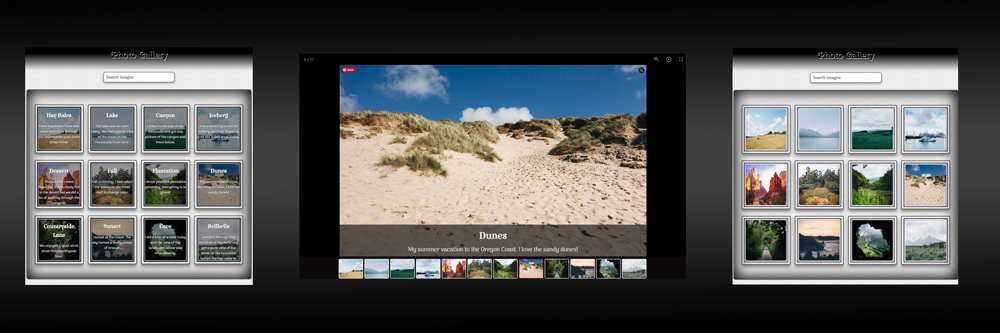

#  Team Treehouse - An Interactive Photo Gallery

This is my fifth project for the [Front End Web Development Techdegree at Treehouse](https://teamtreehouse.com/techdegree/front-end-web-development).

### Description
An Interactive Photo Gallery with photo caption search functionality.

## Table of contents
- [Overview](#overview)
  - [About this project](#about-this-project)
  - [Screenshot](#screenshot)
  - [Link](#links)
- [Process](#my-process) 
  - [Technologies used](#technologies-used) 
  - [What I learned](#what-i-learned) 
  - [Continued development](#continued-development) 
  - [Resource](#resource) 
- [Author](#author) 
- [Acknowledgments](#acknowledgments) 

## Overview
  
### About this project
Users should be able to:
- Click on a thumbnail image to open a larger version in a lightbox plugin.
- Search functionality for images

#### Exceeds Requiremnts
- **Exceeds** Include a Mobile-first design
- **Exceeds** Write your own JavaScript or jQuery code instead of using a jQuery plugin for the search/content filtering requirement.

### Screenshot of my project 5 desktop

### Live Link
- Live Site URL: [Project 5 An Interactive Photo Gallery
](https://samatkinsonmodeste.github.io/treehouse-project-5-interactive-photo-gallery/)

## My Process

### Technologies used

- Semantic HTML5 markup
- Flexbox
- Mobile-first layout
- jQuery
- JavaScript
- lightbox - JS Plugin

### What I learned
This was my first project using JavaScript, and I was very nervous. To my surprise, I found a gallery plugin for myself and understood the documentation to implement the plugin. I loved experimenting with all the different settings or customising.
I loved working with jQuery and found the first couple of lines using the *fadein, fadeout and hide methods* very easy to get the desired effects.
I struggled with the search functionality. I honestly just winged it and went more with instincts and trial and error.🤣

### Continued Development
To replace all jQuery with Vanilla JavaScript.

### Resources
The resource I used for my lightbox plugin was [lightGallery](https://www.lightgalleryjs.com/)

## Author
- Team Treehouse - [samanthaatkinson](https://www.teamtreehouse.com/samanthaatkinson)
- Twitter - [@sammodeste1](https://www.twitter.com/@sammodeste1)
- LinkedIn - [sam-atkinson-modeste](https://www.linkedin.com/<<sam-atkinson-modeste>>)
- GitHub - [SamAtkinsonModeste](https://www.github.com/SamAtkinsonModeste)

## Acknowledgments
I passed this project with **Exceeds Expectations**. I did add a lot of additional styling, and the reviewer was very kind with their final comments. A final comment like the below is what helps build your confidence on this learning journey.
### Reviewer's Final Comment
*Phenomenal job on this first JavaScript project! You have shown a deep understanding of manipulating HTML DOM elements using JavaScript/jQuery, and installing 3rd party libraries and plugins! OUTSTANDING job with all the extra styles, animations, and favicon addition! Keep up the good work and happy coding!*

